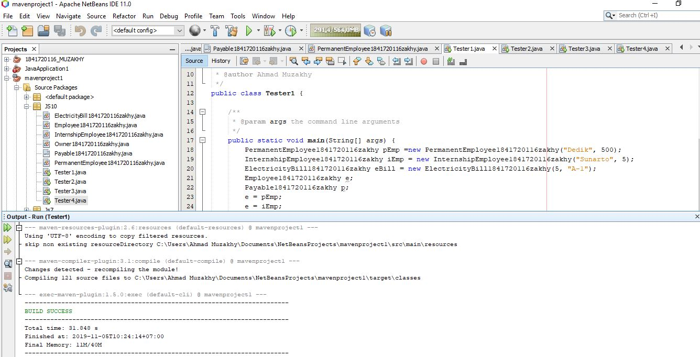
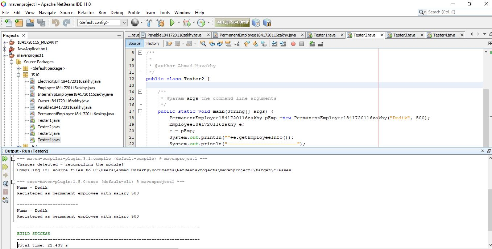
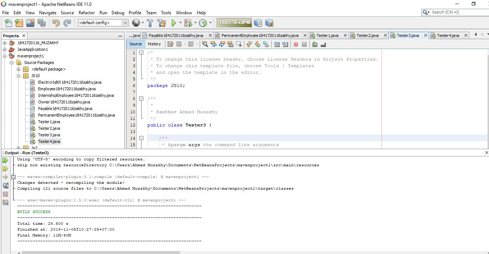
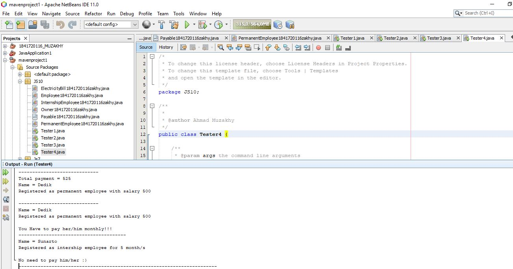
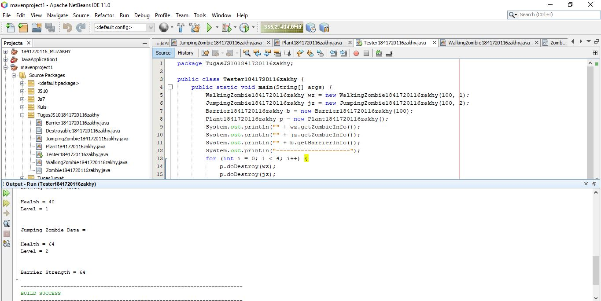

# Laporan Praktikum #10 - Polimorfisme

## Kompetensi
Setelah melakukan percobaan pada jobsheet ini, diharapkan mahasiswa
mampu:
1. Memahami konsep dan bentuk dasar polimorfisme
2. Memahami konsep virtual method invication
3. Menerapkan polimorfisme pada pembuatan heterogeneous collection
4. Menerapkan polimorfisme pada parameter/argument method
5. Menerapkan object casting untuk meng-ubah bentuk objek

## Ringkasan Materi
Sedikit yang saya ketahui dari polimorfisme adalah pengubahan sifat dan atau behaviour dari induk oleh anak. Sehingga sifat general yang berasal dari induk bisa berubah menjadi beberapa sifat sesuai keinginan anak.

relasi yang digunakan pada konsep ini adalah _relasi inheritance_ (is-a)

## Praktikum
### Percobaan 1
Percobaan pertama ini membahas tentang bentuk dasar dari polimorfisme.

#### Pertanyaan
1. Class **InternshipEmployee** dan **PermanentEmployee** merupakan turunan dari class **Employee**
2. Class **PermanentEmployee** dan class **ElectricityBill** merupakan class yang _implements_ ke interface **Payable**
3. karena keduanya memiliki superclass yang sama sehingga bisa mengisi **e** yang merupakan instansiasi dari class **Employee** yang merupakan superclass dari **PermanentEmployee** dan **InternshipEmployee**

4. karena kedua objek tersebut sama sama meng-_implements_ interface **Payable** yang merupakan interface dari objek **p**

5. Error terjadi karena objek **p** tidak meng*extends* class **Employee** yang merupakan superclass dari **InternshipEmployee** dan objek **e** tidak meng*implements* interface **Payable** 

6. Kesimpulannya adalah objek bisa dimasukkan ke dalam array heterogen dan di*casting* jika sama superclassnya. 

#### Kode Program

- [Tester 1](../../src/10_Polimorfisme/Tester1.java)

- [Permanent Employee](../../src/10_Polimorfisme/PermanentEmployee1841720116zakhy.java)
- [Employee](../../src/10_Polimorfisme/Employee1841720116zakhy.java)

- [Payable](../../src/10_Polimorfisme/Payable1841720116zakhy.java)

- [Internship Employee](../../src/10_Polimorfisme/InternshipEmployee1841720116zakhy.java)

- [Electricity Bill](../../src/10_Polimorfisme/ElectricityBill1841720116zakhy.java)

### Percobaan 2
Percobaan kali ini berhubungan dengan virtual machine invocation. Virtual method invocation terjadi ketika ada pemanggilan overriding method
dari suatu objek polimorfisme. Disebut virtual karena antara method yang
dikenali oleh compiler dan method yang dijalankan oleh JVM berbeda.

#### Pertanyaan
1. Karena terjadi perubahan tipe data atau bida disebut casting objek. Dimana tipe data objek e sebelumnya adalah **Employee** berubah menjadi tipe data **PermanentEmployee** sehingga terjadi overriding method, yang artinya pada saat compile time, method yang terbaca saat *compiling* adalah method pada class **Employee** sedangkan pada saar *run time* adalah method pada class **PermanentEmployee**

2. Karena adanya perubahan tipe data pada objek **e** tadi pada perintah e = pEmp. Yang awalnya objek **e** bertipe data **Employee** menjadi tipe data **PermanentEmployee** atau bisa disebut casting

3. Virtual method invocation terjadi ketika ada pemanggilan overriding method
dari suatu objek polimorfisme. Disebut virtual karena antara method yang
dikenali oleh compiler dan method yang dijalankan oleh JVM (_Java Virtual Machine_) berbeda 

#### Kode Program

- [Tester 2](../../src/10_Polimorfisme/Tester2.java)

### Percobaan 3
percobaan kali ini adalah untuk mengetahui definisi dari **Heterogenous Collection** pada objek polimorfisme

#### Pertanyaan
1. objek **e** bisa diisi dengan objek bertipedata beda karena kedua objek tersebut (**pEmp** dan **iEmp**) memiliki superclass yang sama dengan tipedata objek **e** yaitu **Employee**.

2. objek **p** juga sama karena kedua objek memiliki superclass yang sama yaitu **Payable**

3. Karena ada objek yang memiliki lain superclass dengan objek array yang menampung sehingga terjadi error. Dilihat dari fungsi array sendiri yaitu menampung data yang bertipe data sama.

#### Kode Program

- [Tester 3](../../src/10_Polimorfisme/Tester3.java)

### Percobaan 4

Pada percobaan keempat kali ini mencoba untuk bereksperimen dengna **argumen polimorfisme, instance** dan **casting objek**.

#### Pertanyaan
1. keduanya bisa dipanggil karena keduanya sama sama meng*implements* interface **Payable**.

2. Agar class yang mengimplements **Payable** isa dipanggil semua tanpa terkecuali.

3. karena objek **iEmp** tidak meng*implements* interface Payable sehingga ada ketidak cocokan tipe data yang ada pada objek dengan tipe data parameter.

4. untuk dilakukan pengecekan apakah ada hubungan antara objek **p** yang merupakan hasil instansiasi dari interface **Payable** terhadap class **ElectricityBill**. Jika ElectricityBill merupakan hasil implements dari interface Payable maka akan muncul hasil true, jika tidak maka false.

5. Agar bisa memanggil method pada class **ElectricityBill**, karena sebelumnya belum ada instansiasi objek **eb** pada class **Owner** sehingga harus dilakukan casting terhadap objek **p** sebagai penampung dari class lain yang meng*imlements* dirinya (interface **Payable**). Jika dilakukan instansiasi terhadap **ElectricityBill** sendiri maka harus mengisi data baru karena terdapat konstruktor berparameter pada class **ElectrocotyBill**

## Tugas
Tugas kali ini membuat game tentang zombie dengan memanfaatkan inheritance, polimorfisme, abstract dan interface

### Kode Program

- [Tester](../../src/10_Polimorfisme/Tugas/Tester1841720116zakhy.java)
- [Plant](../../src/10_Polimorfisme/Tugas/Plant1841720116zakhy.java)
- [Zombie](../../src/10_Polimorfisme/Tugas/Zombie1841720116zakhy.java)
- [Walking Zombie](../../src/10_Polimorfisme/Tugas/WalkingZombie1841720116zakhy.java)
- [Jumping Zombie](../../src/10_Polimorfisme/Tugas/JumpingZombie1841720116zakhy.java)
- [Destroyable](../../src/10_Polimorfisme/Tugas/Destroyable1841720116zakhy.java)
- [Barrier](../../src/10_Polimorfisme/Tugas/Barrier1841720116zakhy.java)

## Kesimpulan

Polimorfisme bisa dilakukan asalkan subclass sudah mengextends superclass (class biasa maupun abstract class) maupun implements satu atau lebih interface. Sebuha objek subclass bisa berubah tipe data menjadi superclass dengan cara upcasting dan sebaliknya objek dari superclass juga bisa downcast menjadi bertipe data subclass. Ketik terjadi casting dan memanggil method pada objek tersebut maka method yang tampil adalah method pada class setelah casting. 

## Pernyataan Diri

Saya menyatakan isi tugas, kode program, dan laporan praktikum ini dibuat oleh saya sendiri. Saya tidak melakukan plagiasi, kecurangan, menyalin/menggandakan milik orang lain.

Jika saya melakukan plagiasi, kecurangan, atau melanggar hak kekayaan intelektual, saya siap untuk mendapat sanksi atau hukuman sesuai peraturan perundang-undangan yang berlaku.

Ttd,

***AHMAD MUZAKHY***