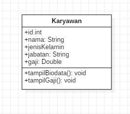
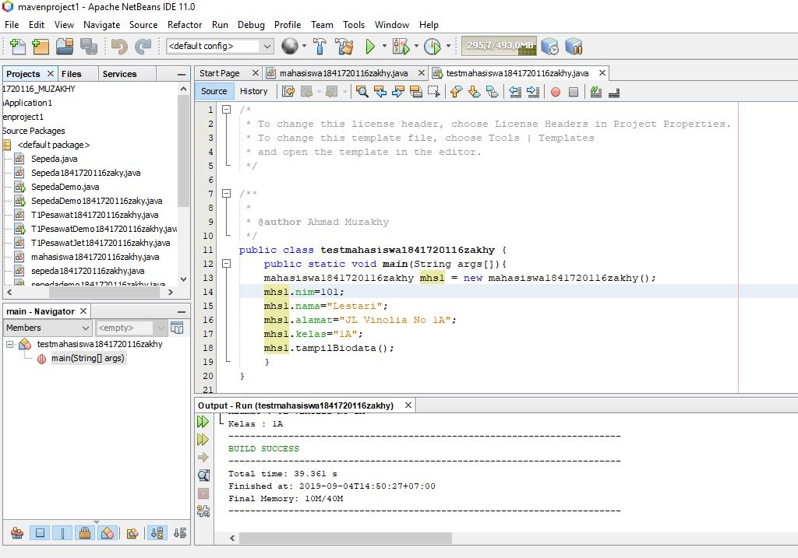
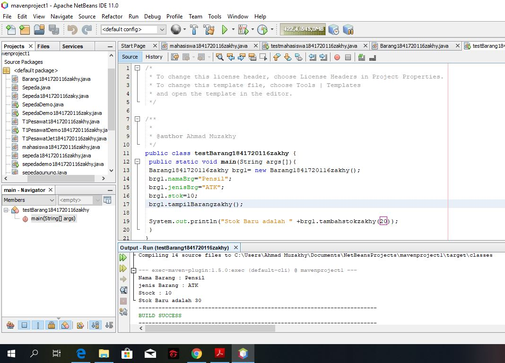
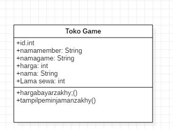
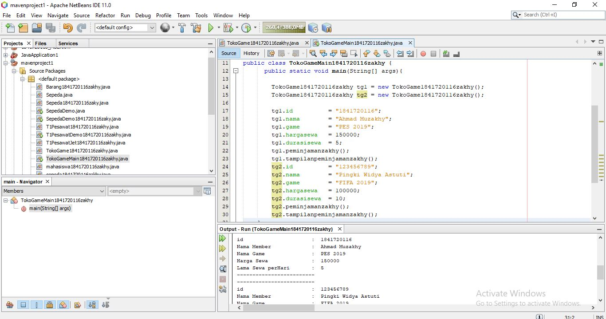

# Laporan Praktikum #2 - Class dan Object

## Kompetensi

-  Mahasiswa dapat memahami deskripsi dari class dan object
-   Mahasiswa memahami implementasi dari class
-   Mahasiswa dapat memahami implementasi dari attribute
-   Mahasiswa dapat memahami implementasi dari method
-   Mahasiswa dapat memahami implementasi dari proses instansiasi
-   Mahasiswa dapat memahami implementasi dari try-catch
-   Mahasiswa dapat memahami proses pemodelan class diagram menggunakan UML

## Ringkasan Materi

Secara singkat class adalah abstraksi dari sebuah object (nyata ataupun tdk nyata) (roger s pressman). 

-   Method adalah suatu blok dari program yang berisi kode program nama dan properti yang dapat digunakan kembali. Method dapat mempunyai nilai balik atau tidak. Method yang tidak mempunyai nilai balik dipanggil dalam pernyataan yang akan dikerjakan, sedangkan method yang mempunyai nilai balik dipanggil dari suatu ekpresi. Kata kunci untuk mengembalikan/mengeluarkan suatu nilai adalah return

-   Proses membuat objek dari suatu class adalah INSTANSIASI, dan ditandai kata kunci new. 

-   Untuk menangani error di Java, digunakan sebuah statement yang bernama try - catch. Statement tersebut digunakan untuk mengurung eksekusi yang menampilkan error dan dapat membuat program tetap berjalan tanpa dihentikan secara langsung. Error yang ditangani oleh try – catch biasa disebut dengan exception.

-   Unified Modeling Language ( UML ) adalah tujuan umum, perkembangan, bahasa pemodelan di bidang rekayasa perangkat lunak , yang dimaksudkan untuk menyediakan cara standar untuk memvisualisasikan desain sistem. 

-   Class diagram adalah sebuah class yang menggambarkan struktur dan penjelasan class, paket, dan objek serta hubungan satu sama lain seperti pewarisan, asosiasi, dan lain-lain. Class diagram juga menjelaskan hubungan antar class dalam sebuah sistem yang sedang dibuat dan bagaimana caranya agar mereka saling berkolaborasi untuk mencapai sebuah tujuan.

## Percobaan

### Percobaan 1 : Membuat Class Diagram

Studi Kasus 1:

Dalam suatu perusahaan salah satu data yang diolah adalah data karyawan. Setiap karyawan di kantor memiliki id, nama, jenis kelamin, jabatan, jabatan, dan gaji. Setiap karyawan juga bisa menampilkan data diri pribadi dan melihat gajinya.

1.Gambarkan desain class diagram dari studi kasus 1!,

2.Sebutkan Class apa saja yang bisa dibuat dari studi kasus 1!
-   Class Karyawan dan Class TestKaryawan

3.Sebutkan atribut beserta tipe datanya yang dapat diidentifikasi dari masing-masing class dari studi kasus 1!
-   int id, String nama, String jenisKelamin, String jabatan, int gaji

4.Sebutkan method-method yang sudah anda buat dari masing-masing class pada studi kasus 1!
-   void tampilData()

### Percobaan 2 : Membuat dan mengakses anggota suatu class

- Class Mahasiswa1841720116zakhy.java

- Class main, TestMahasiswa1841720116zakhy.java

Link kode program : [testmahasiswa1841720116zakhy.java](../../src/2_Class_dan_Object/testmahasiswa1841720116zakhy.java)

7. Jelaskan pada bagian mana proses pendeklarasian atribut pada program diatas!
-  Pada class Mahasiswa1841720116zakhy.java

        public int nim;
        public String nama;
        public String alamat;
        public String kelas;

8. Jelaskan pada bagian mana proses pendeklarasian method pada program diatas!
-  Pada class Mahasiswa1841720116zakhy.java

        public void tampilanBiodatazakhy(){
        System.out.println("Nim     : "+nim);
        System.out.println("Nama    : "+nama);
        System.out.println("Alamat  : "+alamat);
        System.out.println("Kelas   : "+kelas);
        }

9. Berapa banyak objek yang di instansiasi pada program diatas!
-  Hanya satu yaitu pada class TestMahasiswa1841720116zakhy.java

        Mahasiswa1841720116zakhy mhs1=new  Mahasiswa1841720116zakhy();

10. Apakah yang sebenarnya dilakukan pada sintaks program “mhs1.nim=101” ?
-   Kode NIM pada object mhs 1 diisi dengan angka "101"

11. Apakah yang sebenarnya dilakukan pada sintaks program “mhs1.tampilBiodata()?
-   Mencetak atau menampilkan biodata Mahasiswa seperti : nim, nama, alamat, dan kelaspada object mhs1

12. Instansiasi 2 objek lagi pada program diatas!
-   Class main, TestMahasiswa1841720116zakhy.java

Link kode program : [testmahasiswa1841720116zakhy.java](../../src/2_Class_dan_Object/testmahasiswa1841720116zakhy.java)

### Percobaan 3 : Menulis method yang memiliki argument/parameter dan memiliki return

- Class main, TestBarang184720116zakhy.java

Link kode program : [testBarang1841720116zakhy.java](../../src/2_Class_dan_Object/testBarang1841720116zakhy.java)

7. Apakah fungsi argumen dalam suatu method?
-  Untuk memberikan nilai di dalam pada suatu method 

8. Ambil kesimpulan tentang kegunaan dari kata kunci return, dan kapan suatu method harus memiliki return!
-  Kegunaan return adalah untuk memberikan nilai kembalian contoh tipe data sperti int, float, double sedangkan untuk tipe data void tidak memerlukan return karena tidak memberikan nilai kembalian. 

## Tugas
1. Gambar class diagram dari class TokoGame1841720116zakhy

2. Class Tokogame
- Class main, .java 

Link kode program : [TokoGameMain1841720116zakhy.java](../../src/2_Class_dan_Object/TokoGameMain1841720116zakhy.java)

3.
- Class main,
Link kode program :
4.
- Class main,
Link kode program :

## Kesimpulan
- Kita dapat mendemonstrasikan bagaimana membuat class dan object dengan baik dan benar, juga belajar mengunakan waktu dengan baik
- Kita dapat mengetahui aturan penulisan yang benar untuk penulisan sebuah atribut dan method di dalam sebuah program

## Pernyataan Diri

Saya menyatakan isi tugas, kode program, dan laporan praktikum ini dibuat oleh saya sendiri. Saya tidak melakukan plagiasi, kecurangan, menyalin/menggandakan milik orang lain.

Jika saya melakukan plagiasi, kecurangan, atau melanggar hak kekayaan intelektual, saya siap untuk mendapat sanksi atau hukuman sesuai peraturan perundang-undangan yang berlaku.

Ttd,

***(Ahmad Muzakhy)***