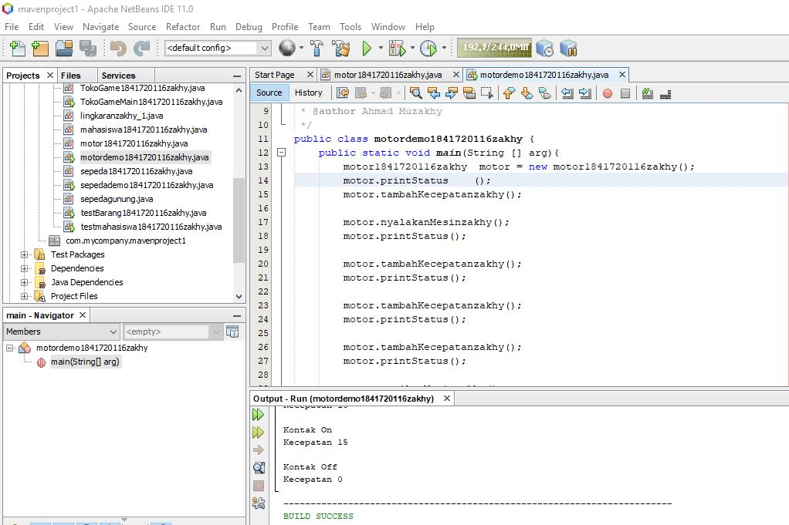
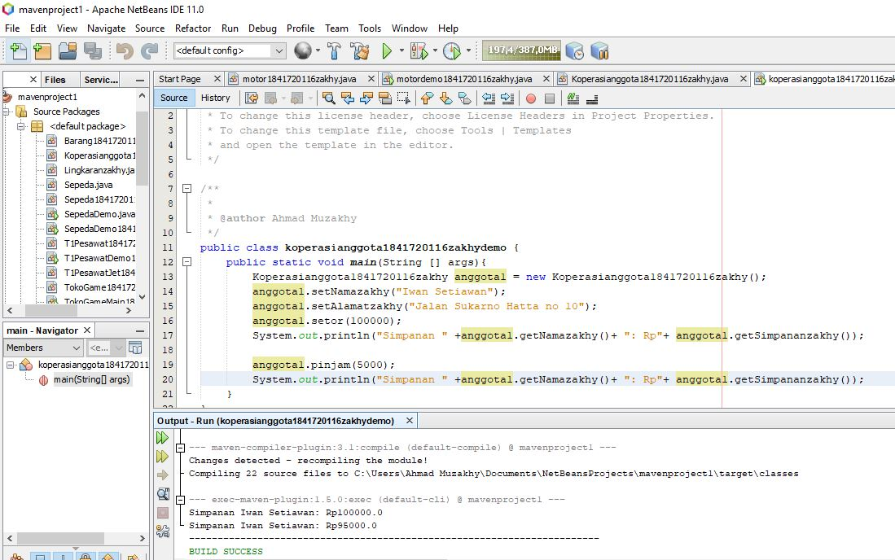
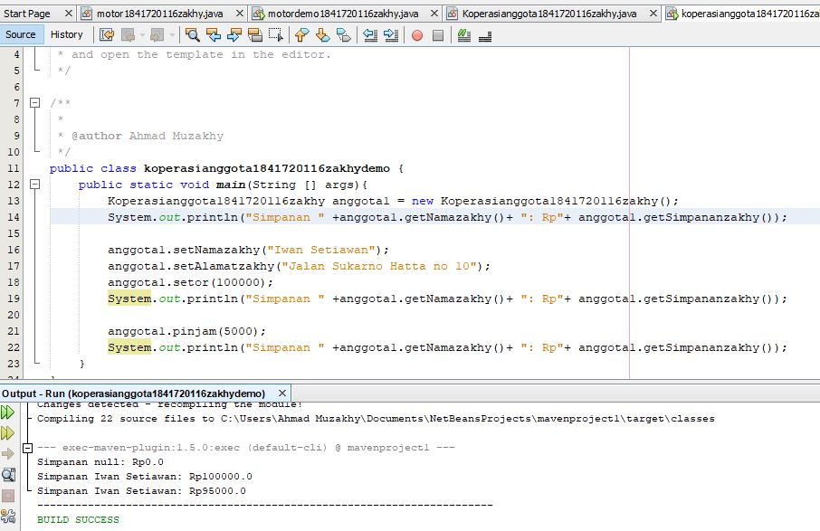
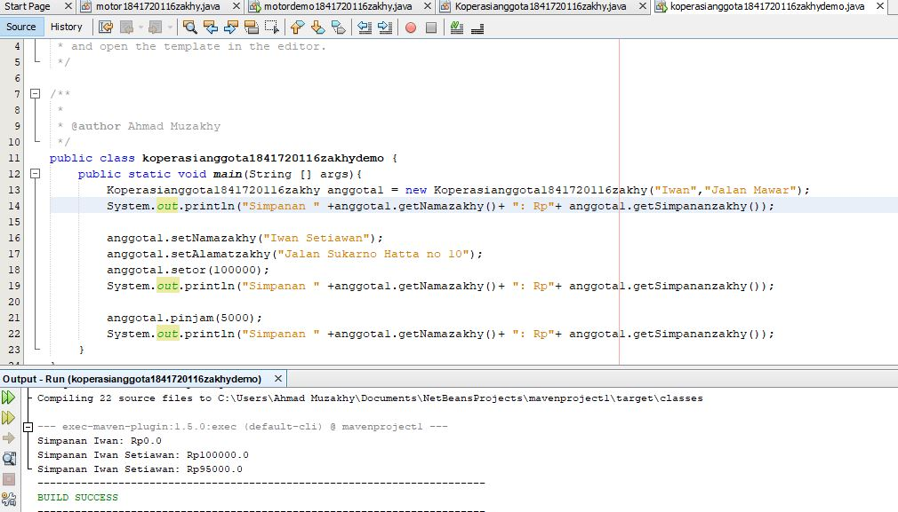
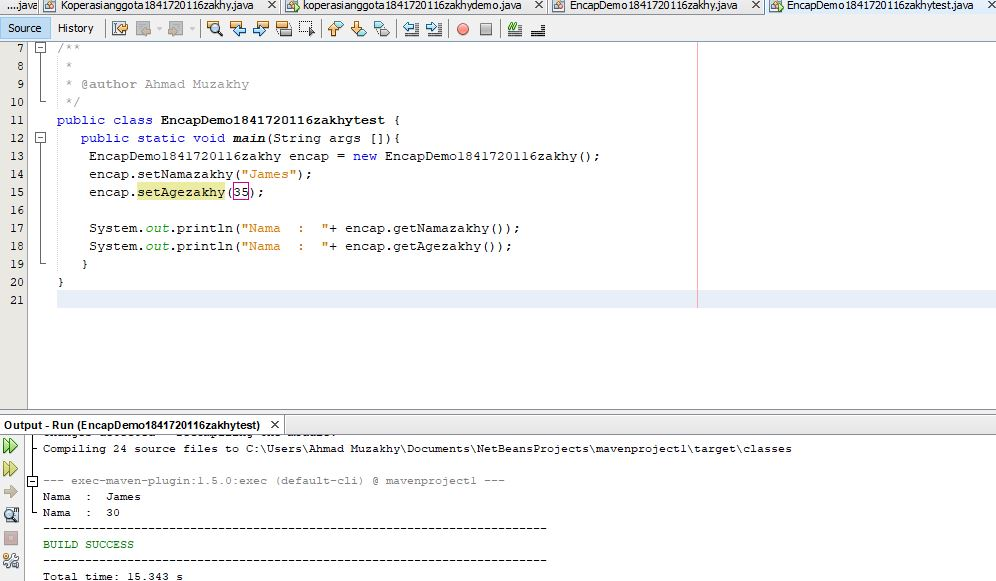
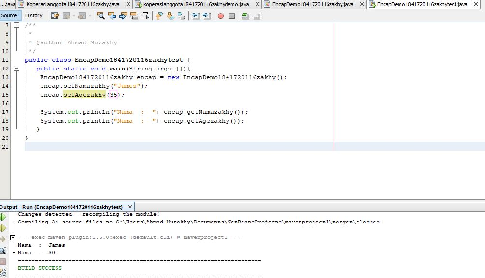
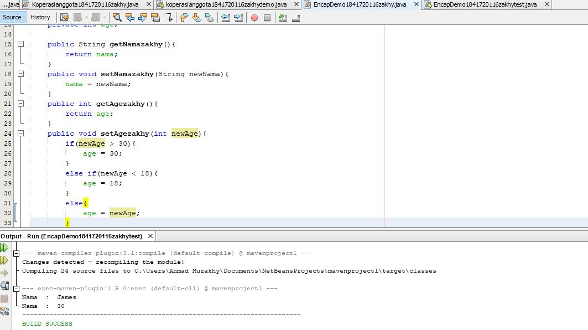

# Laporan Praktikum #3 - Enkapsulasi

## Kompetensi

Setelah melakukan percobaan pada modul ini, mahasiswa memahami konsep:

1.	Konstruktor
2.	Akses Modifier
3.	Atribut/method pada class
4.	Intansiasi atribut/method
5.	Setter dan getter
6.	Memahami notasi pada UML Class Diagram

## Ringkasan Materi

Enkapsukasi disebut juga dengan information-hiding. Dalam berinteraksi dengan objek, seringkali kita tidak perlu mengetahui kompleksitas yang ada didalamnya. Hal ini akan lebih mudah dipahami jika kita membayangkan atau menganalisa objek yang ada disekitar kita, misalnya objek sepeda, ketika kita mengganti gear pada sepeda, kita tinggal menekan tuas gear yang ada di grip setang sepeda saja. Kita tidak perlu mengetahui bagaimana cara gear berpindah secara teknis. 

Konstruktor mirip dengan method cara deklarasinya akan tetapi tidak memiliki tipe return. Dan konstruktor dieksekusi ketika instan dari objek dibuat. Jadi setiap kali sebuat objek dibuat dengan keyword new() maka konstruktor akan dieksekusi. 

Getter adalah public method dan memiliki tipe data return, yang berfungsi untuk mendapatkan nilai dari atribut private. Sedangkan setter adalah public method yang tidak memliki tipe data return, yang berfungsi untuk memanipulasi nilai dari atribut private.

## Percobaan

### Percobaan 1

Didalam percobaan enkapsulasi, buatlah class Motor yang memiliki atribut kecepatan dan kontakOn, dan memiliki method printStatus() untuk menampilkan status motor. 

- Class main, motordemo1841720116zakhy.java

Link kode program : [motordemo1841720116zakhy.java](../../src/3_Enkapsulasi/motordemo1841720116zakhy.java)

### Percobaan 2

Pada percobaan ini akan digunakan access modifier untuk memperbaiki cara kerja class Motor pada percobaan ke-1.

- Class main, motordemo1841720116zakhy.java

Link kode program : [motordemo1841720116zakhy.java](../../src/3_Enkapsulasi/motordemo1841720116zakhy.java)

1.	Pada class TestMobil, saat kita menambah kecepatan untuk pertama kalinya, mengapa muncul peringatan “Kecepatan tidak bisa bertambah karena Mesin Off!”?
-   Karena status kontak masih off, sehingga  kecepatan tidak bisa ditambah kecuali dinyalakan terlebih dahulu

2.	Mengapa atribut kecepatan dan kontakOn diset private?

-   Agar tidak bisa diambil oleh class lain, sehingga atribut kecepatan pada class Motor.java tidak bisa diganti nilainya kecuali dengan method khusus pada class MotorDemo.java 

3.	Ubah class Motor sehingga kecepatan maksimalnya adalah 100!

- Class main, motordemo1841720116zakhy.java

Link kode program : [motordemo1841720116zakhy.java](../../src/3_Enkapsulasi/motordemo1841720116zakhy.java)

### Percobaan 3

Misalkan di sebuah sistem informasi koperasi, terdapat class Anggota. Anggota memiliki atribut nama, alamat dan simpanan, dan method setter, getter dan setor dan pinjam. Semua atribut pada anggota tidak boleh diubah sembarangan, melainkan hanya dapat diubah melalui method setter, getter, setor dan tarik. Khusus untuk atribut simpanan tidak terdapat setter karena simpanan akan bertambah ketika melakukan transaksi setor dan akan berkurang ketika melakukan peminjaman/tarik.

- Class main, koperasianggota1841720116zakhydemo.java

Link kode program : [koperasianggota1841720116zakhydemo.java](../../src/3_Enkapsulasi/koperasianggota1841720116zakhydemo.java)

### Percobaan 4

- Class main, koperasianggota1841720116zakhydemo.java

Link kode program : [koperasianggota1841720116zakhydemo.java](../../src/3_Enkapsulasi/koperasianggota1841720116zakhydemo.java)

### Pertanyaan Percobaan 3 & 4

1. Apa yang dimaksud getter dan setter?
-   Getter adalah public method dan memiliki tipe data return, yang berfungsi untuk mendapatkan nilai dari atribut private. Sedangkan setter adalah public method yang tidak memliki tipe data return, yang berfungsi untuk memanipulasi nilai dari atribut private.

2.	Apa kegunaan dari method getSimpanan()?
-   Merupakan method yang digunakan untuk mendapatkan nilai dari atribut simpanan yang nantinya method tersebut digunakan untuk menampilkan nilai dari atribut simpanan

3.	Method apa yang digunakan untk menambah saldo? 
-   Method setorZaafril pada class Anggota1841720123Zaafril.java

4.	Apa yang dimaksud konstruktor?
-   Konstruktor mirip dengan method cara deklarasinya akan tetapi tidak memiliki tipe return. Dan konsturktor dieksekusi ketika instan dari objek dibuat. Jadi setiap kali sebuat objek dibuat dengan keyword new() maka konstruktor akan dieksekusi. Atau kalau dari pandangan saya konstruktor merupakan cara untuk menambah parameter pada objek.

5.	Sebutkan aturan dalam membuat konstruktor?
-   Nama konstruktor harus sama dengan nama class
-   Konstruktor tidak memiliki tipe data return
-   Konstruktor tidak boleh menggunakan modifier abstract, static, final, dan syncronized

6.	Apakah boleh konstruktor bertipe private?
-   Tidak, bila private maka objek tidak bisa diakes atau tidak bisa di instansiasi oleh class lain

7.	Kapan menggunakan parameter dengan passing parameter?
-   Bila kita menggunakan konstruktor maka sebaiknya kita menggunakan passing parameter dan juga sebaliknya.

8.	Apa perbedaan atribut class dan instansiasi atribut?
-   Class merupakan brueprint dari prototype dari objek, kalau instansiasi dibunakan untuk memanggil sebuah objek dari class yang lain.

9.	Apa perbedaan class method dan instansiasi method?
-   Method merupakan suatu operasi berupa fungsi-fungsi yang dapat dikerjakan oleh suatu object.

## Pertanyaan

1. Cobalah program dibawah ini dan tuliskan hasil outputnya

- Class main, EncapDemo1841720116zakhytest.java

Link kode program : [EncapDemo1841720116zakhytest.java](../../src/3_Enkapsulasi/EncapDemo1841720116zakhytest.java)

2. Pada program diatas, pada class EncapTest kita mengeset age dengan nilai 35, namun pada saat ditampilkan ke layar nilainya 30, jelaskan mengapa.
- Karena pada method setAgeZaafril terdapat percabangan yang didalamnya berisi bila nilai dari atribut age lebih dari 30 maka nilai age akan menjadi 30

3. Ubah program diatas agar atribut age dapat diberi nilai maksimal 30 dan minimal 18. 

- Class main, EncapDemo1841720116zakhytest.java

Link kode program : [EncapDemo1841720116zakhytest.java](../../src/3_Enkapsulasi/EncapDemo1841720116zakhytest.java)

4. Pada sebuah sistem informasi koperasi simpan pinjam, terdapat class Anggota yang memiliki atribut antara lain nomor KTP, nama, limit peminjaman, dan jumlah pinjaman. Anggota dapat meminjam uang dengan batas limit peminjaman yang ditentukan. Anggota juga dapat mengangsur pinjaman. Ketika Anggota tersebut mengangsur pinjaman, maka jumlah pinjaman akan berkurang sesuai dengan nominal yang diangsur. Buatlah class Anggota tersebut, berikan atribut, method dan konstruktor sesuai dengan kebutuhan. Uji dengan TestKoperasi berikut ini untuk memeriksa apakah class Anggota yang anda buat telah sesuai dengan yang diharapkan.

5. Modifikasi soal no. 4 agar nominal yang dapat diangsur minimal adalah 10% dari jumlah pinjaman saat ini. Jika mengangsur kurang dari itu, maka muncul peringatan “Maaf, angsuran harus 10% dari jumlah pinjaman”.

6. Modifikasi class TestKoperasi, agar jumlah pinjaman dan angsuran dapat menerima input dari console.

## Kesimpulan

- Kita dapat mempelajari konsep dari enkapsulasi, kontruktor, access modifier yang terdiri dari 4 jenis yaitu public, protected, default dan private. 

- Kita dapat mempelajari Konsep atribut atau method class yang ada di dalam blok code class dan konsep instansiasi atribut atau method. 

- Kita dapat memahami cara penggunaan getter dan setter beserta fungsi dari getter dan setter. Dan kita dapat mempelajari atau memahami notasi UML

## Pernyataan Diri

Saya menyatakan isi tugas, kode program, dan laporan praktikum ini dibuat oleh saya sendiri. Saya tidak melakukan plagiasi, kecurangan, menyalin/menggandakan milik orang lain.

Jika saya melakukan plagiasi, kecurangan, atau melanggar hak kekayaan intelektual, saya siap untuk mendapat sanksi atau hukuman sesuai peraturan perundang-undangan yang berlaku.

Ttd,

***(Ahmad Muzakhy)***