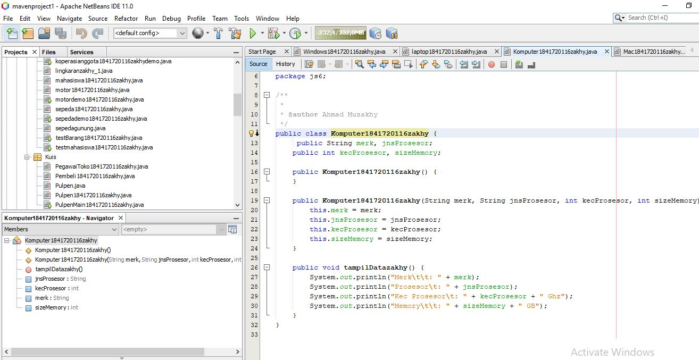
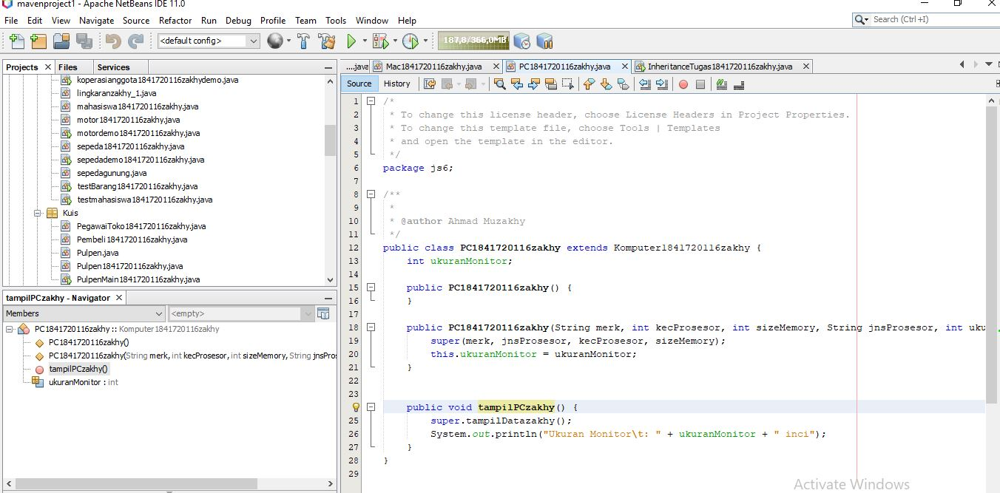

# Laporan Praktikum #6 - Inheritance

## Kompetensi

1. Memahami konsep dasar inheritance atau pewarisan.
2. Mampu membuat suatusublcass dari suatu superclass tertentu.
3. Mampu mengimplmentasikan konsep dan melakukan pengaksesan.
4. Mampu membuat ojek dari suatu subclass dan melakukan. pengaksesan terhadap atribut dan method baik yang dimiliki sendiri atau turunan dari superclassnya.

## Ringkasan Materi

Inheritance atau pewarisan adalah proses penciptaan kelas baru (subclass) dengan cara mewarisi karakteristik dari kelas yang telah ada (superclass) dengan tetap memiliki karakteristik khas dari kelas baru tersebut. Pada bahasa pemrograman java kata kunci yang digunakan untuk inheritance adalah extends dan super. Inheritance memiliki 3 bentuk pewarisan, yaitu single inheritance, multilevel inheritance, dan multiple inheritance.

Single Inheritance: satu subclass hanya mempunyai satu parent class.

Multilevel Inheritance: satu subclass bisa mempunyai beberapa parent class.

## Percobaan

### Percobaan 1

Link kode program ClassA: [Link ke kode program](../../src/6_Inheritance/ClassAzakhy.java)

Link kode program ClassB: [Link ke kode program](../../src/6_Inheritance/ClassBzakhy.java)

Link kode program Percobaan1: [Link ke kode program](../../src/6_Inheritance/Percobaan1.java)

### Percobaan 2 

Link kode program ClassA: [Link ke kode program](../../src/6_Inheritance/ClassAzakhy.java)

Link kode program ClassB: [Link ke kode program](../../src/6_Inheritance/ClassBzakhy.java)

Link kode program Percobaan2: [Link ke kode program](../../src/6_Inheritance/Percobaan2.java)

### Percobaan 3

Link kode program Bangun: [Link ke kode program](../../src/6_Inheritance/Bangun1841720116zakhy.java)

Link kode program Tabung: [Link ke kode program](../../src/6_Inheritance/Tabung1841720116zakhy.java)

Link kode program Percobaan3: [Link ke kode program](../../src/6_Inheritance/Percobaan3.java)

### Percobaan 4

Link kode program ClassD: [Link ke kode program](../../src/6_Inheritance/ClassD1841720116zakhy.java)

Link kode program ClassE: [Link ke kode program](../../src/6_Inheritance/ClassE1841720116zakhy.java)

Link kode program ClassF: [Link ke kode program](../../src/6_Inheritance/ClassF1841720116zakhy.java)

Link kode program Percobaan4: [Link ke kode program](../../src/6_Inheritance/percobaan4.java)

### Percobaan 5

Link kode program Karyawan: [Link ke kode program](../../src/6_Inheritance/Karyawan1841720116zakhy.java)

Link kode program Manager: [Link ke kode program](../../src/6_Inheritance/Manager1841720116zakhy.java)

Link kode program Staff: [Link ke kode program](../../src/6_Inheritance/Staff1841720116zakhy.java)

Link kode program Inheritance1: [Link ke kode program](../../src/6_Inheritance/Inheritance1841720116zakhy.java)

### Percobaan 6

Link kode program StaffTetep: [Link ke kode program](../../src/6_Inheritance/StaffTetap1841720116zakhy.java)

Link kode program StaffHarian: [Link ke kode program](../../src/6_Inheritance/StaffHarian1841720116zakhy.java)

Link kode program Inheritance2: [Link ke kode program](../../src/6_Inheritance/Inheritance21841720116zakhy.java)

## Pertanyaan

### Percobaan 1

1. Pada percobaan 1 ditas program yang dijalankan terjadi error, kemudian perbaiki sehingga program tersebut bisa dijalankan!

2. Jelaskan apa penyebab program pada percobaan 1 ketika dijalankan terdapat error!

    Error terjadi karena pada ClassB tidak mengenali variable x dan y yang terletak di ClassA dan pada objek hitung ClassB objek hitung tidak mengenali method getNilai() 

### Percobaan 2

1. Pada percobaan 2 di atas program yang dijalankan terjadi error, kemudian perbaiki sehingga program tersebut bisa dijalankan dan tidak error!

2. Jelaskan apa penyebab program pada percobaan 2 ketika dijalankan terdapat error!

    Program error karena pada ClassB pada method getJumlah(), ClassB tidak mengenali variable x dan y karena kedua variable tersebut dalam ClassA memiliki access modifier private, sehingga hanya ClassA saja yang mengenali variable x dan y.

### Percobaan 3

1. Jelaskan fungsi "super" pada potongan program berikut di class Tabung!

    Fungsi super pada potongan kode program di atas adalah sebagai representasi objek dari kelas induk (kelas Bangun) dan mengisi nilai varibale phi yang ada di kelas induk dengan nilai dari variable phi (sebagai parameter).

2. Jelaskan fungsi "super" dan "this" pada potongan program berikut di class Tabung!

   

     Fungsi super pada potongan kode program di atas adalah sebagai representasi objek dari kelas induk (kelas Bangun) dan 
     memberi referensi pada kelas Tabung bahwa phi adalah variable phi yang ada di kelas Bangun.

     Fungsi this pada potongan kode program di atas adalah sebagai referensi dari class itu sendiri sehingga r pada method tersebut adalah variable r pada kelas Tabung.

3. Jelaskan mengapa pada class Tabung tidak dideklarasikan atribut "phi" dan "r" tetepi class tersebut dapat mengakses atribut tersebut!

    Karena kelas Tabung merupakan turunan dari kelas Bangun yang memiliki variable phi dan r dengan access modifier protected.

### Percobaan 4

1. Pada percobaan 4 sebutkan mana class yang termasuk superclass dan subclass, kemudian jelaskan alasannya!

    Yang termasuk super class adalah ClassA karena memiliki turunan yaitu ClassB dan ClassB karena memiliki turunan yaitu ClassC.
    
    Yang termasuk subclass adalah ClassB karena merupakan turunan dari ClassA dan ClassC karena merupakan turunan dari ClassB.

2. Ubalah isi konstruktor default ClassC seperti berikut:

    Tambahkan kata super() di baris Pertaman dalam konstruktor defaultnya. Coba jalankan kembali class Percobaan 4 dan terlihat tidak ada perbedaan dari hasil outputnya!

3. Ubahlah isi konstruktor default ClassC seperti berikut:

    Ketika mengubah posisi super() dibaris kedua dalam konstruktor defaultnya dan terlihat ada error. Kemudian kembalikan super() kebaris pertama seperti sebelumnya, maka errornya akan hilang.

    Perhatikan hasil keluaran ketika class Percobaan4 dijalankan. Kenapa bisa tampil seperti berikut pada saat instansiasi objek test dari class ClassC.

    Jelaskan bagaimana urutan proses jalannya konstruktor saat objek test dibuat!

    Ketika objek test dari ClassC dibuat maka secara otomatis akan memanggil konstruktor dari ClassC dimana konstruktor ClassC akan memanggil konstruktor ClassB karena ClassC merupakan turunan dari ClassB dan seterusnya sampai ClassA.

4. Apakah fungsi super() pada potongan program dibawah ini di ClassC!

    super() digunakan untuk memanggil method pada parent class (ClassB).

### Percobaan 5

1. Sebutkan class mana yang termasuk super class dengan sub class dari percobaan 1 diatas!

    Yang termasuk super class adalah kelas Karyawan dan yang termasuk subclass adalah kelas Manager dan kelas Staff.

2. Kata kunci apakah yang digunakan untuk menurunkan suatu class ke class yang lain?

    Kata kunci apakah yang digunakan untuk menurunkan suatu class ke class yang lain extends.

3. Perhatikan kode program pada class Manager, atribut apa saja yang dimiliki oleh class tersebut? cfSebutkan atribut mana saja yang diwarisi dari class Karyawan!

    Atribut yang dimiliki kelas Manager tunjangan dan memiliki semua atribut dari kelas Karyawan.

4. Jelaskan kata kunci super pada potongan program di bawah ini yang terdapat pada class Manager!

    Kata kunci super pada potongan kode program tersebut memiliki arti bahwa atribut gaji adalah atribut gaji pada kelas Karyawan.

5. Program pada percobaan 1 diatas termasuk dalam jenis inheritance apa? Jelaskan alasannya!

    Percobaan 1 diatas termasuk dalam jenis inheritance multiple inheritance karena satu superclass memiliki beberapa subclass. 

### Percobaan 6

1. Berdasarkan class diatas manakah yang termasuk single inheritance dan mana yang termasuk multilevel inheritance?

    Kedua class diatas termasuk multilevel inheritance.

2. Perhatikan kode program class StaffTetap dan StaffHarian, atribut apa saja yang dimiliki oleh class tersebut? Sebutkan atribut mana saja yang diwarisi dari class Staff!

    Atribut StaffTetap adalah golongan dan gaji. Atribut yang diwarisi dari kellas Staff adalah lembur dan potongan.

3. Apakah fungsi potongan program berikut pada class StaffHarian?

    Memanggil atribut nama,alamat,jk,umur,gaji,lembur, dan potongan dari kelas superclass.

4. Apakah fungsi potongan program berikut pada class StaffHarian?

    Memanggil method tampilDataStaff() dari kelas Staff.

5. Perhatikan kode program dibawah ini yang terdapat pada class StaffTetap

    Terlihat dipotongan program diatas atribut gaji, lembur dan potongan dapat diakses langsung. Kenapa hal ini bisa terjadi dan bagainama class StaffTetap memiliki atribut gaji lembur, dan potongan padahal dalam class tersebut tidak dideklakarsikan atribut gaji, lembur, dan potongan?

    Karena kelas StaffTetap merupakan kelas turunan dari kelas Staff sehingga ia bisa mengakses atribut dari kelas Staff dan superclassnya yang memiliki access modifier public atau protected.

## Tugas

Link kode program Komputer: [Link ke kode program](../../src/6_Inheritance/Komputer1841720116zakhy.java)

Link kode program Leptop: [Link ke kode program](../../src/6_Inheritance/laptop1841720116zakhy.java)

Link kode program PC: [Link ke kode program](../../src/6_Inheritance/PC1841720116zakhy.java)

Link kode program MAC: [Link ke kode program](../../src/6_Inheritance/Mac1841720116zakhy.java)

Link kode program Windows: [Link ke kode program](../../src/6_Inheritance/Windows1841720116zakhy.java)

Link kode program InheritanceTugas: [Link ke kode program](../../src/6_Inheritance/tugas/InheritanceTugas1851720116zakhy.java)

## Kesimpulan

Inheritance dapat digunakan untuk membuat class yang lebih spesifik dari class yang sudah ada yang masih bersifat general atau umum. Inheritance mempermudah programmer untuk membuat program dengan cara programmer tidak perlu menulis kode program yang sama untuk kelas yang berbeda namun memiliki karakteristik yang sama.

## Pernyataan Diri

Saya menyatakan isi tugas, kode program, dan laporan praktikum ini dibuat oleh saya sendiri. Saya tidak melakukan plagiasi, kecurangan, menyalin/menggandakan milik orang lain.

Jika saya melakukan plagiasi, kecurangan, atau melanggar hak kekayaan intelektual, saya siap untuk mendapat sanksi atau hukuman sesuai peraturan perundang-undangan yang berlaku.

Ttd, 

Ahmad Muzakhy

