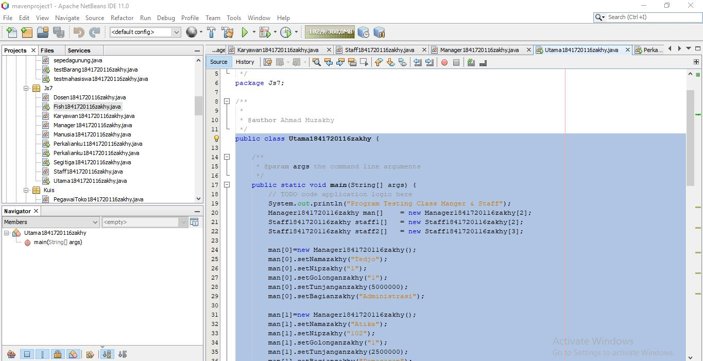

# Laporan Praktikum #7 - Overloading dan Overriiding

## Kompetensi

Setelah menempuh pokok bahasan ini mahasiswa mampu :

* Memahami konsep overloading dan overriding.
* Memahami perbedaan overloading dan overriding.
* Ketepatan dalam mengidentifikasi method overriding dan overloading.
* Ketepatan dalam mempratekkan instruksi pada jobsheet.
* Menimplementasikan method overloading dan overriding.

## Ringkasan Materi 

### Overloading

Overloading adalah suatu cara untuk memudahkan penggunaan method dengan nama yang sama, fungsi yang mirip namun memiliki parameter (signature) yang berbeda.

Syarat pendeklarasian method overloading:

1. Nama method harus sama.
2. Parameter harus berbeda.
3. Bisa memiliki return type yang sama maupun berbeda.

### Overriding

Overriding adalah proses memodifikasi behaviour method diwarisi oleh superclass. Tujuan overriding adalah memberikan behaviuor yang sesuai.

Syarat pendeklarasian method overriding:

1. Overriding hanya bisa dilakukan oleh kelas yang menereapkan konserp inheritance.
2. Nama method, parameter, dan return type harus sama.
3. Mode akses overriding method harus sama atau lebih luas dari pada overridden method.

## Percobaan

### Percobaan 1

Link kode program Karyawan: [Link ke kode program](../../src/7_Overriding_dan_Overloading/Karyawan1841720116zakhy.java)

Link kode program Manager: [Link ke kode program](../../src/7_Overriding_dan_Overloading/Manager1841720116zakhy.java)

Link kode program Staff: [Link ke kode program](../../src/7_Overriding_dan_Overloading/Staff1841720116zakhy.java)

Link kode program Utama: [Link ke kode program](../../src/7_Overriding_dan_Overloading/Utama1841720116zakhy.java)

## Pertanyaan

1. Dari source code diatas terletak dimanakah overloading?

    Overloading terletak pada dua method perkalian() yang masing-masing memiliki jumlah parameter dua dan tiga yang sama-sama bertipe integer.

2. Jika terdapat overloading ada berapa jumlah parameter yang berbeda?

    Ada satu parameter yang berbeda, yaitu antara perkalian(int a, int b) dan perkalian(int a, int b, int c).

1. Dari source code diatas terletak dimanakah overloading?

    Overloading terletak pada dua method perkalian() yang memiliki jumlah parameter dua dan memiliki tipe parameter yang berbeda.

2. Jika terdapat overloading ada berapa jumlah parameter yang berbeda?

    Ada dua tipe parameter yang berbeda.

1. Dari source code diatas terletak dimanakah overriding?

    Overriding terletak pada method swim pada kelas Piranha.

2. Jabarkanlah apabila source code diatas jika terdapat overriding!

    Objek a akan memanggil method swim() yang ada di kelas Ikan sedangkan objek b akan memanggil method swim() yang ada di kelas Piranha.

## Tugas

Link kode program Seigita: [Link ke kode program](../../src/7_Overriding_dan_Overloading/Segitiga1841720116zakhy.java)

Link kode program MainSegitiga: [Link ke kode program](../../src/7_Overriding_dan_Overloading/MainSegitiga1841720116zakhy.java)

Link kode program Manusia: [Link ke kode program](../../src/7_Overriding_dan_Overloading/Manusia1841720116zakhy.java)

Link kode program Dosen: [Link ke kode program](../../src/7_Overriding_dan_Overloading/Dosen1841720116zakhy.java)

Link kode program Mahasiswa: [Link ke kode program](../../src/7_Overriding_dan_Overloading/Mahasiswa1841720116zakhy.java)

Link kode program MainManusia: [Link ke kode program](../../src/7_Overriding_dan_Overloading/MainManusia1841720116zakhy.java)

## Kesimpulan

Overloading digunakan apabila terdapat suatu method yang memiliki nama yang sama namun memiliki parameter yang berbeda.Overloading bisa digunakan di beragam kelas.

Overriding digunakan untuk mengubah/memodifikasi behaviour method yang terdapat di superclass agar bisa berfungsi sesuai dengan method yang ada di subclass dengan cara memberikan nama, parameter, dan return type yang sama.

## Pernyataan Diri

Saya menyatakan isi tugas, kode program, dan laporan praktikum ini dibuat oleh saya sendiri. Saya tidak melakukan plagiasi, kecurangan, menyalin/menggandakan milik orang lain.

Jika saya melakukan plagiasi, kecurangan, atau melanggar hak kekayaan intelektual, saya siap untuk mendapat sanksi atau hukuman sesuai peraturan perundang-undangan yang berlaku.

Ttd, 

Ahmad Muzakhy

