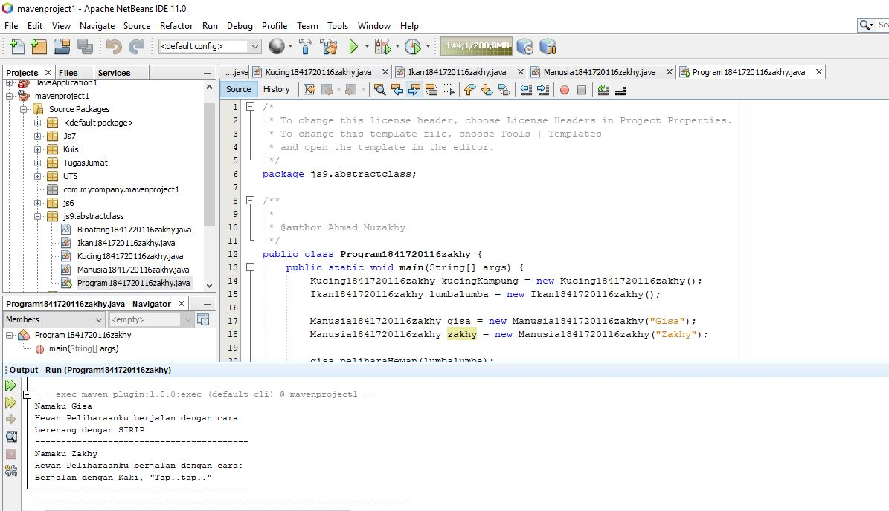
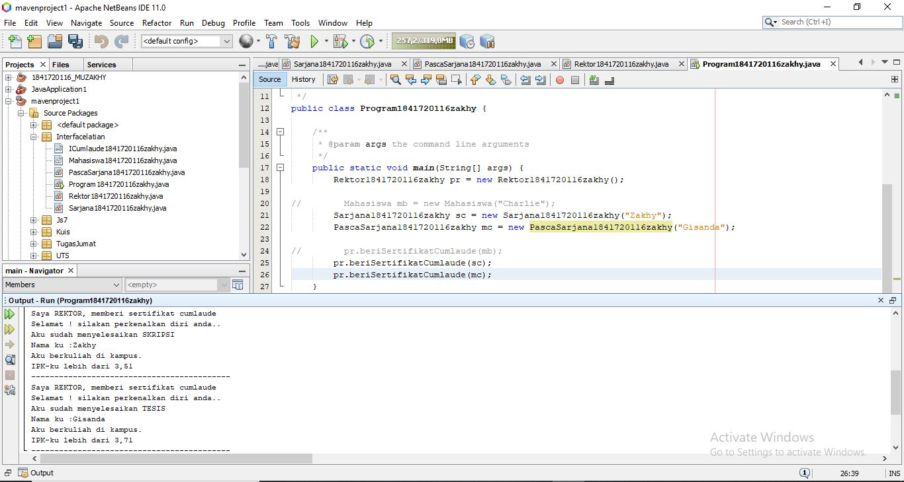
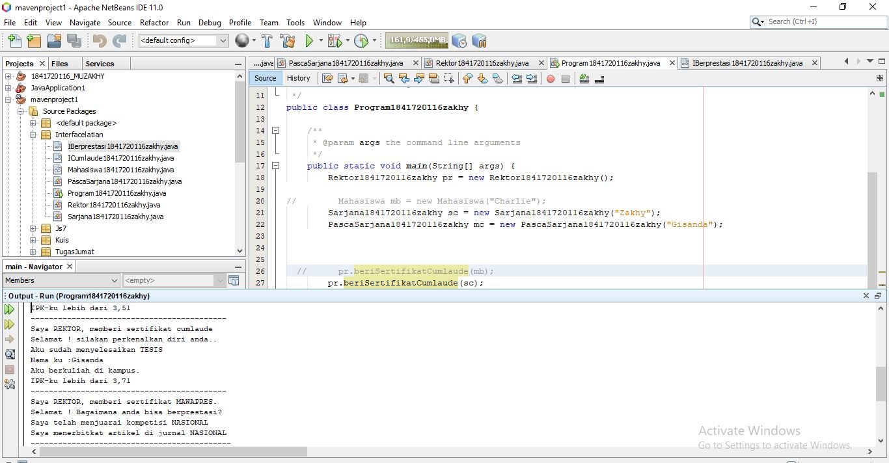

# Laporan Praktikum #9 - Abstract Class dan Interface

# Kompetensi
Setelah menyelesaikan lembar kerja ini mahasiswa diarapkan mampu:

Menjelaskan maksud dan tujuan penggunaan Abstract Class
Menjelaskan maksud dan tujuan penggunaan Interface
Menggunakan Abstract Class dan Interface di dalam pembuatan program
# Ringkasan Materi
Pada praktikum ini saya mengalami kesulitan konsep class abstract, untuk solusi dari permasalahan yang saya alami dapat diselesaikan dengan lebih belajar lagi.

# Percobaan

# Percobaan 1
Pada percobaan pertama saya membuat empat buah class, yang pertama bernama Binatang1841720116zakhy yang memiliki atribut nama dengan tipe data String selain itu terdapat konstruktor dan method bertambahUmur() dan bergerak. Kedua adalah class dengan nama Kucing1841720116zakhy yang merupakan turunan dari Hewan1841720116zakhy dan memiliki method bergerak(). Yang ketiga adalah class dengan nama Ikan1841720116zakhy yang merupakan Binatang1841720116zakhy dan memiliki method bergerak(). Yang terakhir adalah saya membuat class bernama Manusia1841720116zakhy yang memiliki atribut nama dengan tipe data String dan hewanPeliharaan yang memiliki tipe data dari class Binatang1841720116zakhy, selain atribut terdapat konstruktor berparameter atribut nama dan juga terdapat method peliharaanHewan() dan ajakPeliharaanJalanJalan() untuk menampilkan value pada atribut nama dan juga untuk menampilkan value pada ethod bergerak() yang tersambung pada atribut hewanPeliharaan.

Binatang1841720116zakhy: [Klik disini](../../src/9_Abstract_Class_dan_Interface/abstractclass/Binatang1841720116zakhy.java)

Ikan1841720116zakhy: [Klik disini](../../src/9_Abstract_Class_dan_Interface/abstractclass/Ikan1841720116zakhy.java)

Kucing1841720116zakhy: [Klik disini](../../src/9_Abstract_Class_dan_Interface/abstractclass/Kucing1841720116zakhy.java)

Manusia1841720116zakhy: [Klik disini](../../src/9_Abstract_Class_dan_Interface/abstractclass/Manusia1841720116zakhy.java)

Program1841720116zakhy: [Klik disini](../../src/9_Abstract_Class_dan_Interface/abstractclass/Program1841720116zakhy.java)

# Pertanyaan
Bolehkah apabila sebuah class yang meng-extend suatu abstract class tidak mengimplementasikan method abstract yang ada di class induknya? Buktikan!

Jawab:

Tidak boleh, karena kelas turunan harus mengoverride method yang ada dari kelas parent dan bila tidak maka akan muncul error, misalnya di kelas Kucing1841720116zakhy dihapus method bergerak(), makan akan muncul error.

# Percobaan 2
Pada percobaan kedua saya membuat satu buah interface dan empat buah class, yang pertama bernama Icumlaude1841720116zakhy yang merupakan interface dan memiliki method lulus() dan meraihIPKTinggi(). Kedua adalah class dengan nama Mahasiswa1841720116zakhy yang memiliki atribut bernama nama dengan tipe data String, selain atribut terdapat konstruktor berparameter satu dan method kuliahDiKampus() untuk menampilkan value dari atribut nama. Yang ketiga adalah class dengan nama Sarjana1841720116 yang merupakan turunan dari Mahasiswa1841720116zakhy dan implemen dari Icumlaude1841720116zakhy, selain itu terdapat konstruktor Sarjana1841720116zakhy untuk memanggil atribut nama dari parent class dan terdapat dua method yaitu lulus() dan meraihIPKTinggi(). Ketiga adalah class PascaSarjana1841720116zakhy yang merupakan child class dari Mahasiswa dan implement dari Icumlaude1841720116zakhy dan konstruktor PascaSarjana yang memanggil atribut nama dari parent classnya selain itu, terdapat method lulus() dan juga method bernama meraihIPKTinggi(). Keempat adalah class dengan nama Rektor1841720116zakhy yang memiliki method beriSertifikatCumlaude yang menampilkan hasil pada method lulus() dan meraihIPKTinggi(). Yang terakhir adalah saya membuat main class bernama Program1841720116zakhy.

ICumlaude1841720116zakhy: [Klik disini](../../src/9_Abstract_Class_dan_Interface/Interfacelatian/ICumlaude1841720116zakhy.java)

Program1841720116zakhy: [Klik disini](../../src/9_Abstract_Class_dan_Interface/Interfacelatian/Program1841720116zakhy.java)

Mahasiswa1841720116zakhy: [Klik disini](../../src/9_Abstract_Class_dan_Interface/Interfacelatian/Mahasiswa1841720116zakhy.java)

PascaSarjana1841720116zakhy: [Klik disini](../../src/9_Abstract_Class_dan_Interface/Interfacelatian/PascaSarjana1841720116zakhy.java)

Rektor1841720116zakhy: [Klik disini](../../src/9_Abstract_Class_dan_Interface/Interfacelatian/Rektor1841720116zakhy.java)

Sarjana1841720116zakhy: [Klik disini](../../src/9_Abstract_Class_dan_Interface/Interfacelatian/Sarjana1841720116zakhy.java)

# Pertanyaan

Mengapa pada langkah nomor 9 terjadi error? Jelaskan!

Jawab:

Karena pada class Mahasiswa1841720116zakhy tidak ter-implementasi interfaces dari Icumlaude1841720116zakhy sehingga error ketika akan dipanggil oleh object pakRektor.

Dapatkah method kuliahDiKampus() dipanggil dari objek sarjanaCumlaude di class Program? Mengapa demikian?

Jawab:

Bisa, karena object sarjanaCumlaude dari class Sarjana1841720116zakhy adalah kelas turunan dari Mahasiswa1841720116zakhy, sehingga method kuliahDiKampus() bisa dipanggil ke class Sarjana1841720116zakhy.

Dapatkah method kuliahDiKampus() dipanggil dari parameter mahasiswa di method beriSertifikatCumlaude() pada class Rektor? Mengapa demikian?

Jawab:

Tidak bisa, karena class Rektor1841720116zakhy hanya menggunakan implementasi dari Icumlaude1841720116zakhy, dan method kuliahDiKampus() dari class Mahasiswa1841720116zakhy tidak pernah di inisiasi di class Rektor1841720116zakhy.

Modifikasilah method beriSertifikatCumlaude() pada class Rektor agar hasil eksekusi class Program menjadi seperti berikut:

# Percobaan 3

Pada percobaan ketiga saya membuat satu buah class interface bernama IBerprestasi1841720116zakhy karena pada percobaan 3 ini masih berhubungan dengan percobaan 3, yang berisi method menjuaraiKompetisi() dan membuatPublkasiIlmiah(). dan pada class PacsaSarjana1841720116zakhy menambahkan satu implement lagi yaitu IBerprestasi1841720116zakhy maka dan akan menambahkan dua method lagi yaitu menjuaraiKompetisi() dan membuatPublkasiIlmiah(). Selain itu pada class Rektor1841720116zakhy menambahkan method dengan nama beriSertifikatMawapres() yang digunakan untuk menampilkan value pada method menjuaraiKompetisi() dan membuatPublkasiIlmiah().

ICumlaude1841720116zakhy: [Klik disini](../../src/9_Abstract_Class_dan_Interface/Latian3/ICumlaude1841720116zakhy.java)

IBerprestasi1841720116zakhy: [Klik disini](../../src/9_Abstract_Class_dan_Interface/Latian3/IBerprestasi1841720116zakhy.java)

Mahasiswa1841720116zakhy: [Klik disini](../../src/9_Abstract_Class_dan_Interface/Latian3/Mahasiswa1841720116zakhy.java)

PascaSarjana1841720116zakhy: [Klik disini](../../src/9_Abstract_Class_dan_Interface/Latian3/PascaSarjana1841720116zakhy.java)

Program1841720116zakhy: [Klik disini](../../src/9_Abstract_Class_dan_Interface/Latian3/Program1841720116zakhy.java)

Rektor1841720116zakhy: [Klik disini](../../src/9_Abstract_Class_dan_Interface/Latian3/Rektor1841720116zakhy.java)

Sarjana1841720116zakhy: [Klik disini](../../src/9_Abstract_Class_dan_Interface/Latian3/Sarjana1841720116zakhy.java)

# Pertanyaan
Apabila Sarjana Berprestasi harus menjuarai kompetisi NASIONAL dan menerbitkan artikel di jurnal NASIONAL, maka modifikasilah class-class yang terkait pada aplikasi Anda agar di class Program objek pakRektor dapat memberikan sertifikat mawapres pada objek sarjanaCumlaude

# Kesimpulan
Hal yang dapat saya simpulkan dari praktikum yang telah dilakukan adalah Abstract Class yang merupakan class yang tidak dapat diinstansiasi namun dapat di-extend selain hal tersebut interface juga berperan penting dalam pembuatan abstract class tersebut.

# Pernyataan Diri
Saya menyatakan isi tugas, kode program, dan laporan praktikum ini dibuat oleh saya sendiri. Saya tidak melakukan plagiasi, kecurangan, menyalin/menggandakan milik orang lain.

Jika saya melakukan plagiasi, kecurangan, atau melanggar hak kekayaan intelektual, saya siap untuk mendapat sanksi atau hukuman sesuai peraturan perundang-undangan yang berlaku.

Ttd,

***(Ahmad Muzakhy)***